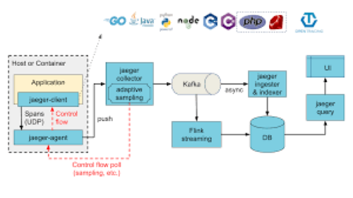

# Jaeger Operator
### Overview
Jaeger, inspired by Dapper and OpenZipkin, is a distributed tracing system released as open source by Uber Technologies. It is used for monitoring and troubleshooting microservices-based distributed systems.

Core capabilities
Jaeger is used for monitoring and troubleshooting microservices-based distributed systems, including:

- Distributed context propagation
- Distributed transaction monitoring
- Root cause analysis
- Service dependency analysis
- Performance / latency optimization
- OpenTracing compatible data model
- Multiple storage backends: Badger, Cassandra, Elasticsearch, Memory.

**Operator features:**

- Multiple modes - Supports allInOne, production and streaming modes of deployment.

- Configuration - The Operator manages configuration information when installing Jaeger instances.

- Storage - Configure storage used by Jaeger. By default, memory is used. Other options include badger, cassandra or elasticsearch. On OpenShift, the operator can delegate creation of an Elasticsearch cluster to the Elasticsearch Operator if deployed.

- Agent - can be deployed as sidecar (default) and/or daemonset.

- UI - Optionally setup ingress (Kubernetes) or secure route (OpenShift) to provide access to the Jaeger UI.

**Jaeger Operator Architectural Flow**

Jaeger can be deployed either as all-in-one binary, where all Jaeger backend components run in a single process, or as a scalable distributed system, discussed below. There are two main deployment options:

1.Collectors are writing directly to storage.
2.Collectors are writing to Kafka as a preliminary buffer.

The following diagram illustrates the overall architecture:
Illustration of direct-to-storage architecture:

Illustration of architecture with Kafka as intermediate buffer:

Jaeger client libraries
Jaeger client, which is part of your application and is responsible for creating tracers and spans in the application code. The Jaeger client creates trace spans in the application code which get picked up by the Jaeger agent over UDP and forwarded to the Jaeger collector using a secured gRPC connection. 

Agent
The Jaeger agent is a network daemon that listens for spans sent over UDP, which it batches and sends to the collector. It is designed to be deployed to all hosts as an infrastructure component. The agent abstracts the routing and discovery of the collectors away from the client.

Collector
The Jaeger collector receives traces from Jaeger agents and runs them through a processing pipeline. Currently our pipeline validates traces, indexes them, performs any transformations, and finally stores them.Jaeger collector stores the data so that you can query and visualize the trace spans using the Jaeger query service. 

Jaeger’s storage is a pluggable component which currently supports Cassandra, Elasticsearch and Kafka.

Query
Query is a service that retrieves traces from storage and hosts a UI to display them.

Ingester
Ingester is a service that reads from Kafka topic and writes to another storage backend (Cassandra, Elasticsearch).

***Jaeger deployment strategies***:

There are three pre-defined Jaeger deployment strategies that are supported by the Jaeger Operator. A deployment strategy dictates how the Jaeger components should be deployed on OpenShift.The Jaeger Operator currently supports the following deployment strategies:

***allInOne (Default)*** - This strategy is intended for development, testing, and demo purposes. The main backend components, Agent, Collector and Query service, are all packaged into a single executable which is configured (by default) to use in-memory storage.
In-memory storage is not persistent, which means that if the Jaeger instance shuts down, restarts, or is replaced, that your trace data will be lost. And in-memory storage cannot be scaled, since each pod has its own memory. For persistent storage, you must use the production or streaming strategies, which use Elasticsearch as the default storage.

***production*** - The production strategy is intended for production environments, where long term storage of trace data is important, as well as a more scalable and highly available architecture is required. Each of the backend components is therefore deployed separately. The Agent can be injected as a sidecar on the instrumented application or as a daemonset. The Query and Collector services are configured with a supported storage type - currently Elasticsearch. Multiple instances of each of these components can be provisioned as required for performance and resilience purposes.

***streaming*** - The streaming strategy is designed to augment the production strategy by providing a streaming capability that effectively sits between the Collector and the backend storage (Elasticsearch). This provides the benefit of reducing the pressure on the backend storage, under high load situations, and enables other trace post-processing capabilities to tap into the real time span data directly from the streaming platform (AMQ Streams/ Kafka).
